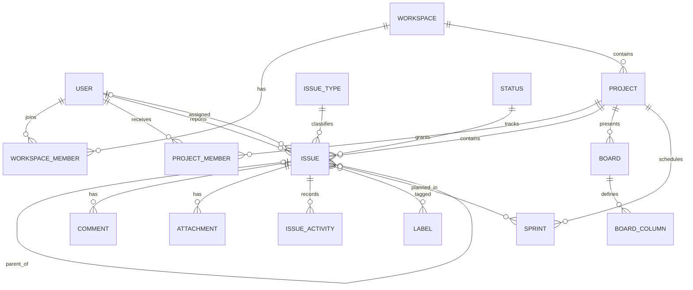

# Product and Technical Design

## 1. Design principles

- **Work stays visible:** Important ownership, status, priority, and due-date information is scannable.
- **Fast by default:** Common edits are inline or available through a focused issue drawer.
- **Progressive complexity:** New teams receive useful defaults; advanced configuration stays in settings.
- **Context is preserved:** Opening an issue should not make users lose their board, backlog, or search position.
- **Safe feedback:** Optimistic interactions clearly recover when persistence fails.
- **Accessible interaction:** Every drag-and-drop action has a keyboard-accessible alternative.

## 2. Information architecture

```text
Workspace
├── Home
├── Projects
│   └── Project
│       ├── Summary
│       ├── Board
│       ├── Backlog
│       ├── Issues
│       └── Settings
├── Your work
├── Search
├── Notifications
└── Workspace settings
    ├── Members
    ├── Roles
    ├── Audit log
    └── General
```

## 3. Application shell

Desktop uses a persistent left sidebar, a top contextual header, and a main content area. The sidebar contains workspace switching, global create, search, primary navigation, starred/recent projects, and account access.

Tablet collapses the sidebar to an icon rail or temporary drawer. Mobile uses a compact header and bottom or drawer navigation; board columns become horizontally scrollable, while issue lists provide a more accessible alternative.

## 4. Key screen designs

### Kanban board

```text
┌─────────────────────────────────────────────────────────────────────┐
│ WEB Project / Board        Search  Filter  Group     + Create issue │
├─────────────────────────────────────────────────────────────────────┤
│ TO DO (8)          IN PROGRESS (3)      REVIEW (2)       DONE (12)  │
│ ┌───────────────┐  ┌───────────────┐    ┌────────────┐  ┌────────┐ │
│ │ WEB-142       │  │ WEB-138       │    │ WEB-131    │  │ ...    │ │
│ │ Checkout bug  │  │ Profile page  │    │ API tests  │  └────────┘ │
│ │ High · Sam    │  │ Story · 5     │    │ Alex · 3   │             │
│ └───────────────┘  └───────────────┘    └────────────┘             │
│ ┌───────────────┐                                                  │
│ │ ...           │                                                  │
│ └───────────────┘                                                  │
└─────────────────────────────────────────────────────────────────────┘
```

Board cards display key, summary, type, priority, assignee, estimate, and selected warning indicators. Clicking opens an issue drawer without leaving the board. Dragging updates status and rank optimistically. Column menus provide a non-drag move command.

### Issue details

The issue experience uses a centered full page on small screens and a wide drawer on desktop when entered from a board or list.

```text
┌──────────────────────────────────────────────────────────────┐
│ WEB-142  Bug                                  Watch  •••  ×  │
│ Checkout fails when coupon is removed                         │
├───────────────────────────────────────┬──────────────────────┤
│ Description                           │ Status: In progress  │
│ Reproduction steps and expected...    │ Assignee: Sam        │
│                                       │ Priority: High       │
│ Attachments                           │ Parent: WEB-120      │
│                                       │ Sprint: Sprint 8     │
│ Activity | Comments                   │ Estimate: 3          │
│ [Write a comment…]                    │ Due: Aug 25          │
└───────────────────────────────────────┴──────────────────────┘
```

Frequently changed fields are editable in place. Destructive and infrequent actions remain in an overflow menu. The activity feed distinguishes comments from system changes.

### Backlog

The backlog contains an active sprint section, optional planned sprint section, and backlog. Rows support selection, ranking, inline assignee/estimate changes, and expansion for subtasks. A persistent summary shows issue and estimate totals.

### Search and issue list

The issue list combines a keyword field, filter chips, saved-filter control, sortable columns, pagination, and bulk selection. Filter state is represented in the URL to support sharing and browser navigation.

## 5. Visual system direction

- Neutral surfaces with one configurable workspace accent color
- Status colors are supportive, never the only status indicator
- 8-pixel spacing grid with compact and comfortable list densities
- Clear typography hierarchy optimized for dense operational information
- Consistent issue-type and priority icons with accessible labels
- Light theme for MVP; dark theme is P1
- Reusable feedback patterns: skeleton, empty state, inline error, toast, confirmation dialog

## 6. Proposed architecture

Use a TypeScript modular monolith for the MVP:

```text
Browser
  │ HTTPS
  ▼
Next.js web application
  ├── Server-rendered UI and route handlers
  ├── Authentication and authorization boundary
  ├── Workspace/project/issue modules
  ├── Board and search modules
  └── Notification and audit modules
          │
          ├── PostgreSQL
          ├── Object storage
          ├── Redis/queue (when asynchronous jobs are enabled)
          └── Email provider
```

Recommended starting stack:

- Next.js with TypeScript
- PostgreSQL
- Prisma ORM
- Tailwind CSS and an accessible component foundation
- Managed authentication, selected after resolving product requirements
- S3-compatible object storage
- PostgreSQL full-text/trigram search initially
- Redis-backed jobs when email and heavier asynchronous work arrive
- Playwright for end-to-end tests plus a unit/integration test runner

The exact packages should be confirmed against current supported versions immediately before scaffolding.

## 7. Module boundaries

- **Identity:** Account, session, invitation, profile
- **Workspace:** Tenant, membership, role, preferences
- **Project:** Project, project membership, configuration
- **Issue:** Issue, fields, relations, comments, attachments, watchers
- **Workflow:** Status, category, transition, validation
- **Planning:** Board, column, rank, sprint, backlog
- **Search:** Indexing, filtering, saved filters
- **Notification:** Event preferences, inbox, email delivery
- **Audit:** Immutable administrative and domain event records
- **Files:** Upload authorization, metadata, scanning, download authorization

Modules share one database during the initial release but must not bypass each other's service boundaries in application code.

## 8. Conceptual data model



All tenant-owned tables include `workspace_id`, even when it can be derived through a relationship. This supports explicit authorization filters, indexes, auditability, and safer future partitioning.

Important entities include:

- User, Workspace, WorkspaceMember
- Project, ProjectMember
- IssueType, Priority, Status, WorkflowTransition
- Issue, IssueLabel, IssueLink, Watcher
- Comment, Attachment, IssueActivity
- Board, BoardColumn, Sprint
- SavedFilter, Notification, AuditEvent

## 9. API conventions

- Resource-oriented endpoints or typed server actions with a stable service layer
- Validate all input at the boundary
- Derive workspace identity from authorized context, never trusted request fields alone
- Cursor pagination for growing timelines; page or cursor pagination for issue lists
- Consistent problem response containing code, message, field errors, and correlation ID
- Optimistic concurrency token for issue and board mutations
- Idempotency keys for invitation, import, upload finalization, and other retry-prone writes
- Transactional outbox for reliable notification/event processing when background workers are introduced

## 10. Ranking and board consistency

Issues use fractional or lexicographically sortable rank values, avoiding updates to every issue during reorder. A move request contains issue ID, destination status/column, neighboring ranks, and the issue version. The server authorizes the transition, computes the definitive rank, increments the version, commits an activity event, and returns canonical state.

Clients optimistically render the move. On version conflict, they refresh the affected columns and notify the user rather than silently overwriting another change.

## 11. Search strategy

MVP search uses PostgreSQL indexes for issue keys and structured filters, with full-text or trigram indexes for summary and description. Every query must constrain `workspace_id` before matching. Search is isolated behind a module so it can later move to a dedicated engine if scale or ranking requirements justify it.

## 12. File design

1. Client requests an authorized upload slot with filename, type, size, and issue ID.
2. Server validates permissions and constraints and returns a short-lived signed upload URL.
3. Client uploads directly to object storage.
4. Client finalizes the upload; server stores attachment metadata and queues scanning if configured.
5. Downloads use authorization-checked, short-lived signed URLs.

## 13. Testing strategy

- Unit tests for ranks, permissions, workflow rules, validation, and notification selection
- Integration tests for database constraints, transactions, tenant isolation, and APIs
- End-to-end tests for onboarding, issue lifecycle, board moves, backlog/sprint, search, and member permissions
- Accessibility checks for key screens and manual keyboard testing of the board
- Migration tests against a production-like database snapshot before release
- Load tests for issue lists, board loading, concurrent moves, and notification fan-out before wider launch

## 14. Design deliverables before implementation

- Confirmed sitemap and navigation model
- Low-fidelity flows for onboarding, issue creation, board, backlog, and search
- High-fidelity designs for the application shell and core screens
- Responsive variants for board and issue details
- Component inventory and design tokens
- Clickable prototype tested with at least five representative users
- Documented usability findings and accepted changes

